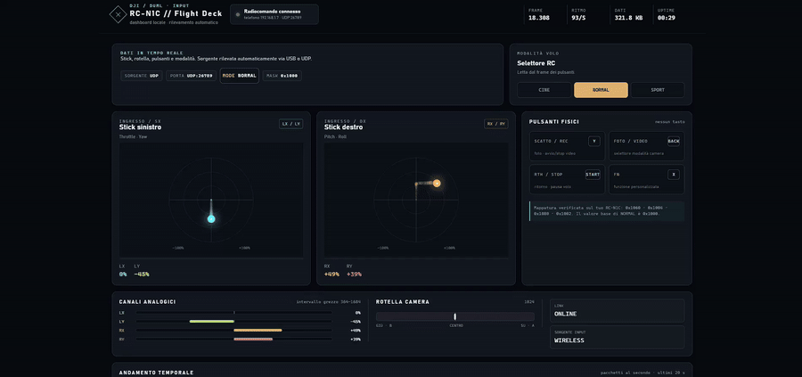

# DJI RC-N1C Flight Deck

Bridge open source non ufficiale per usare il radiocomando **DJI RC-N1C** con simulatori di volo su PC.

Il progetto offre:

- controller Xbox 360 virtuale tramite ViGEmBus;
- lettura degli stick, della rotella e dei pulsanti fisici;
- dashboard real-time con stato della connessione, modalità e qualità del segnale;
- collegamento wireless tramite Android o Termux;
- autodetection della porta USB e del PC nella rete locale;
- build automatica dell'app Android tramite GitHub Actions.

## Controlli supportati

| Controllo RC-N1C | Input virtuale |
| --- | --- |
| Stick sinistro | LX / LY |
| Stick destro | RX / RY |
| Rotella camera | A / B |
| Scatto / registrazione | Y |
| Selettore foto/video | BACK |
| RTH / STOP | START |
| FN | X |
| Sport / Normal / Cine | Stato della dashboard |

## Avvio su Windows

Requisiti:

- Windows con Python 3.12;
- pacchetti Python `pyserial`, `vgamepad` e `websockets`;
- driver ViGEmBus;
- radiocomando acceso collegato tramite un cavo USB-C dati.

Chiudi eventuali applicazioni DJI che possono occupare la connessione USB, poi usa uno dei launcher:

- `AVVIA_BRIDGE.bat` — avvia il controller virtuale per i simulatori;
- `viz_app\AVVIA_VIZ.bat` — apre la dashboard e rileva automaticamente il radiocomando;
- `AVVIA_BUTTON_LIVE_PROBE.bat` — mostra i pulsanti rilevati senza creare un gamepad.

Il collegamento `RC-N1C Dashboard.vbs` sul Desktop è il launcher con un click: rileva USB o Wi-Fi,
apre la dashboard e crea automaticamente il controller Xbox virtuale. In modalità USB usa un solo
processo, così la porta COM4 non viene aperta contemporaneamente da dashboard e bridge.

La dashboard è locale e non utilizza servizi o risorse esterne.

## Demo

[](docs/media/flight-deck-demo.mp4)

Clicca sull’anteprima per aprire la registrazione completa.

## Modalità wireless

Il telefono può funzionare da ponte tra radiocomando e PC:

```text
RC-N1C → Android → UDP → PC → gamepad virtuale
```

Avvia `viz_app\AVVIA_VIZ_WIFI.bat` sul PC e usa l'app Android `wireless\RCN1C_Bridge.apk`. L'indirizzo IP del PC può essere lasciato vuoto: l'app tenta l'autodiscovery nella rete locale. Termux è supportato come alternativa; le istruzioni sono in [docs/uso-wireless.md](docs/uso-wireless.md).

Per ricostruire l'APK:

```powershell
$env:ANDROID_HOME = "$env:LOCALAPPDATA\Android\Sdk"
powershell -ExecutionPolicy Bypass -File wireless\android-app\build_apk.ps1
```

Non avviare contemporaneamente i due receiver Wi-Fi: entrambi utilizzano la porta UDP 26789.

## Aggiornamenti

L'app Android esegue all'avvio un controllo iniziale della versione e della presenza del radiocomando, senza avviare automaticamente il bridge. Il pulsante **AVVIA** resta sempre manuale. Da **Impostazioni** è possibile modificare IP/porta e lanciare **CONTROLLA AGGIORNAMENTI**: se trova una versione nuova, chiede conferma prima di scaricare e aprire l'installazione dell'APK. Android richiede sempre la conferma dell'utente per un APK installato fuori dallo store.

Su Windows è disponibile anche il controllo da PowerShell:

```powershell
powershell -ExecutionPolicy Bypass -File tools\Update-DroneApp.ps1
powershell -ExecutionPolicy Bypass -File tools\Update-DroneApp.ps1 -InstallApk
```

Il workflow `.github/workflows/release.yml` ricostruisce e pubblica l'APK quando viene creato un tag versione, per esempio `v3.2.0`. Il controllo verifica la versione della release e l'hash SHA-256 dell'APK quando disponibile.

## Sviluppo e test

```powershell
$py = "$env:LOCALAPPDATA\Programs\Python\Python312\python.exe"
& $py tests\run_all.py
& $py tests\ui_smoke.py
```

Il protocollo DUML e il mapping verificato sono descritti in [docs/protocollo-rcn1c.md](docs/protocollo-rcn1c.md). Il progetto è pensato per simulatori e non deve essere usato per pilotare un drone reale.

## Licenza

Distribuito con [licenza MIT](LICENSE).
